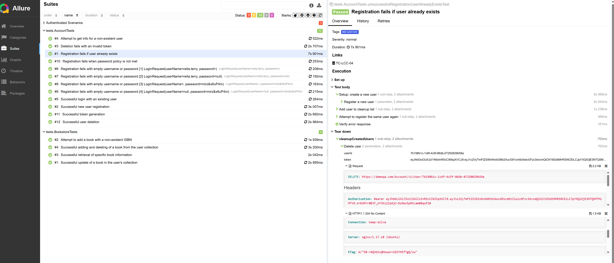
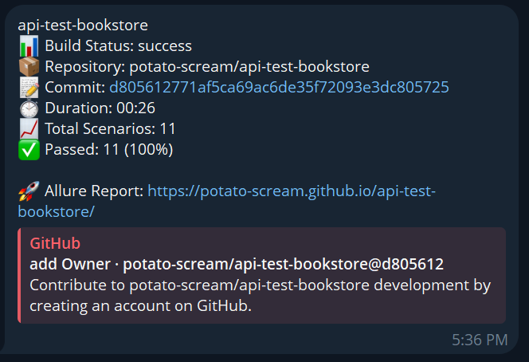

# Bookstore API Tests


## 📄 Overview

The repository contains automated tests for the public DemoQA API (BookStore module and account management). Covered scenarios include registration and authentication, token generation, reading a user profile, as well as operations with the book collection (fetch, add, update, clean up) and negative checks.

The project architecture is divided into layers (API clients, models, specifications, tests). Reports are generated in Allure and published via GitHub Actions. The suite is compact and can serve as a base for further extension.

### 🧰 Technology Stack

| Purpose                | Tool / Library                                      |
| ---------------------- | --------------------------------------------------- |
| Build                  | Gradle 8.14                                         |
| Language / JDK (CI)    | Java (Temurin JDK 17)                               |
| Test Framework         | JUnit 5 (5.11.2)                                    |
| API Automation         | RestAssured (5.4.0)                                 |
| Reporting              | Allure (2.27.0), allure-junit5, allure-rest-assured |
| JSON Schema Validation | json-schema-validator (5.4.0)                       |
| Assertions             | AssertJ (3.26.0)                                    |
| Configuration          | Owner (1.0.12)                                      |
| Test Data              | JavaFaker (1.0.2)                                   |
| Logging                | SLF4J Simple (2.0.7)                                |
| Development            | Spotless (6.25.0)                                   |

## 📑 Table of Contents

* [📄 Overview](#-overview)
* [🧰 Technology Stack](#-technology-stack)
* [✨ Project Highlights](#-project-highlights)
* [▶️ Test Execution](#️-test-execution)
* [🛠 Local Setup (Owner)](#-local-setup-owner)
* [📊 Reports](#-reports)

## ✨ Project Highlights

* **Layered architecture for API.** Directories are separated by role: `api/` (clients with `@Step`), `models/` (POJO with Lombok/Jackson), `specs/` (shared `Request/ResponseSpecification`), `tests/` (scenarios). This simplifies maintenance and extension.
* **Unified RestAssured specifications.** Reusable Accept/Content-Type, logging, and Allure filter reduce duplication and keep request/response logs consistent.
* **Contract checks.** JSON Schema Validation is applied to registration, login, token, and user profile responses, catching contract deviations early.
* **Informative reports.** Annotations `@Feature`, `@Story`, `@DisplayName`, `@TmsLink` plus Freemarker templates (`request.ftl`, `response.ftl`) make HTTP interactions readable in Allure.
* **Parameterized negative cases.** `@ParameterizedTest` + `@MethodSource` handle empty-value scenarios and make boundary expansions straightforward.
* **Data generation.** JavaFaker produces valid logins/passwords without brittle fixtures.
* **State control.** Tests clean up (deleting temporary users) in `@AfterEach`, reducing cross-test influence.
* **Flexible configuration.** Owner reads credentials from system properties (CI passes `-Dlogin/-Dpassword`) and can fall back to a classpath properties file.
* **Code quality gate.** Spotless runs before tests to enforce a consistent code style.
* **CI/CD automation.** GitHub Actions builds and runs tests, generates the Allure report, publishes it to GitHub Pages, and sends a Telegram summary. This shortens feedback cycles in practice.



## ▶️ Test Execution

Full run:

```
./gradlew clean test
```

With credentials:

```
./gradlew test -Dlogin=YOUR_LOGIN -Dpassword=YOUR_PASSWORD
```

Targeted run:

```
./gradlew test --tests "tests.AccountTests"
./gradlew test --tests "tests.BookstoreTests.getSpecificBookInfoTest"
```

> JUnit 5 `@Tag` filtering is available; in the current configuration, using `--tests` is recommended for targeted runs.

## 🛠 Local Setup (Owner)

System properties take precedence. Recommended options:

* Pass values via Gradle command line:

  ```
  -Dlogin=... -Dpassword=...
  ```
* Or add a file `src/test/resources/config/credentials.properties` with:

  ```
  login=...
  password=...
  ```

  On CI these values are overridden by secrets provided as system properties.

## 📊 Reports

Local generation:

```
./gradlew allureReport
./gradlew allureServe
```

In CI the Allure report is published to GitHub Pages; a Telegram summary is sent (status, test count, duration, link to the report).



References:

* Allure: [https://docs.qameta.io/allure/](https://docs.qameta.io/allure/)
* RestAssured: [https://rest-assured.io/](https://rest-assured.io/)
